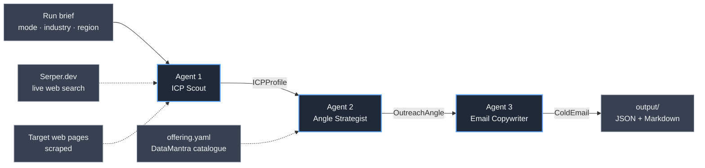

# Hyper-Targeted Cold Outreach

A 3-agent CrewAI pipeline that researches a real prospect, maps their pain to a DataMantra offering, and writes a 3-sentence cold email grounded in live web evidence.

## What it does

Cold outreach for [DataMantra](https://thedatamantra.com/) (an ed-tech platform for data/AI/finance upskilling) is usually generic. This system solves that by automating the research, angle, and email in a way that produces personalized, citable outreach:

1. **Agent 1** (`icp_scout`) finds a specific prospect (company or person) with a real, citable pain signal in data/AI/finance upskilling — using live Serper web search.
2. **Agent 2** (`angle_strategist`) maps that pain to the right DataMantra course track from a grounding catalogue, with a concrete mechanism and proof point.
3. **Agent 3** (`email_copywriter`) writes a 3-sentence email under strict constraints (≤75 words, no generic openers, exactly one observed detail that proves research was done).

Each handoff is typed via Pydantic models, so outputs are structured and machine-readable. Results are written to JSON and a human-readable Markdown file.

## Architecture



**Pipeline walkthrough:**

- **Agent 1 (ICP Scout)** uses Serper.dev web search and page scraping to find one specific, named prospect (a company or person) showing a real pain signal. It grounds every claim in ≥2 real quotes and URLs, and honestly reports low confidence when evidence is thin rather than inventing detail.

- **Agent 2 (Angle Strategist)** takes the researched ICP and a YAML catalogue of DataMantra's actual offerings. It picks the one course track that best solves the pain, states the mechanism (how it solves it), and cites a proof point (alumni placements, case studies) to make it credible. It never invents offerings or misnames them — they come verbatim from the catalogue.

- **Agent 3 (Email Copywriter)** writes a 3-sentence email under hard constraints: exactly 3 sentences, ≤75 words, no "I hope this finds you well" / "quick question" openers or superlatives, and sentence 1 must prove real research was done (e.g., referencing a specific job posting or LinkedIn post). Sentence 2 connects the pain to the offering with proof. Sentence 3 is a low-friction CTA.

All three agents run sequentially, with later agents receiving the output of earlier ones via CrewAI's `context=` mechanism.

## Agents

| Agent | Role | Tools | Output |
|-------|------|-------|--------|
| **icp_scout** | ICP & Pain Researcher | `SerperDevTool`, `ScrapeWebsiteTool` | `ICPProfile` — a named prospect with ≥2 citable evidence pieces, pain point, and confidence level |
| **angle_strategist** | Offer–Pain Angle Strategist | none (reasons over ICP + offering catalogue) | `OutreachAngle` — the matched offering (verbatim from catalogue), mechanism, proof, and flags for what to avoid |
| **email_copywriter** | Cold Email Copywriter | none | `ColdEmail` — subject, 3-sentence body (≤75 words), CTA, personalization hook, word count |

## B2B vs B2C Modes

The crew supports two modes, switchable per run:

### B2B — Company with an L&D / talent gap

Finds a **company** in the given industry/region showing a concrete data/AI/finance hiring or upskilling need.

- **What we're looking for:** Open data analyst / data scientist roles, L&D announcements, digital-transformation news, hiring surges, or leadership quotes about needing data/AI capability.
- **Who we're reaching:** Decision-makers like Head of L&D, Data Lead, or CHRO.
- **Email tone:** Professional, peer-to-peer, consultative — one L&D operator to another, not a vendor pitch.
- **CTA style:** A low-friction ask (e.g., "15-minute call") framed as optional.

### B2C — Individual signalling a career switch

Finds an **individual** publicly expressing interest in switching careers into data, AI, or finance.

- **What we're looking for:** LinkedIn posts mentioning "career transition," "switching to data science," course announcements, or similar public statements of intent.
- **Who we're reaching:** The person directly, on a mentor-to-mentee basis.
- **Email tone:** Warm, encouraging — like a mentor reaching out, not a company blasting a list.
- **CTA style:** An easy, non-salesy next step (e.g., "here's a free resource," "short chat," course info link).

## Setup

### Prerequisites

- **Python 3.10–3.13** (CrewAI 1.15.21 does not support 3.9 or 3.14)
- API keys from:
  - [OpenRouter](https://openrouter.ai/keys) — for Claude (or another model)
  - [Serper.dev](https://serper.dev) — for web search

### Virtual Environment

**Option 1: Using `uv` (faster)**

```bash
uv venv --python 3.11 .venv
uv pip install -r requirements.txt
source .venv/bin/activate
```

**Option 2: Using plain `pip`**

```bash
python3.11 -m venv .venv
source .venv/bin/activate
pip install -r requirements.txt
```

(On Windows, use `.venv\Scripts\activate` instead of `source .venv/bin/activate`.)

### Environment Variables

Copy `.env.example` to `.env` and fill in your API keys:

```bash
cp .env.example .env
```

Then edit `.env`:

```
OPENROUTER_API_KEY=your_key_here
SERPER_API_KEY=your_key_here
OPENROUTER_MODEL=anthropic/claude-sonnet-5
```

- **`OPENROUTER_API_KEY`** — Get it from https://openrouter.ai/keys
- **`SERPER_API_KEY`** — Get it from https://serper.dev
- **`OPENROUTER_MODEL`** (optional) — Defaults to `anthropic/claude-sonnet-5`. Other options:
  - `anthropic/claude-sonnet-4.5` — slightly cheaper, still high quality
  - `google/gemini-2.5-flash` — much cheaper (~$0.05–$0.10 per run), tested and works well as a budget option
  - Any other [OpenRouter model](https://openrouter.ai/models)

**Never commit `.env` to git** — it's in `.gitignore` for safety.

## Usage

### Streamlit UI (recommended)

```bash
source .venv/bin/activate
streamlit run app.py
```

Then open http://localhost:8501 in your browser. You'll see:

- **Sidebar:** Mode radio (B2B/B2C), industry, region, optional seed hint (company/person name), model override
- **Main area:** "Run crew" button that executes the pipeline and displays results in three cards:
  - ICP Profile (name, pain point, evidence with clickable URLs)
  - Outreach Angle (matched offering, mechanism, proof, what to avoid)
  - Cold Email (subject, body, word count, personalization hook)
- **Download:** JSON export button

### CLI

```bash
source .venv/bin/activate
PYTHONPATH=src python -m cold_outreach.main --mode b2b --industry fintech --region India
```

Flags:

- `--mode {b2b,b2c}` — Outreach mode (default: `b2b`)
- `--industry TEXT` — Target industry, e.g. `fintech`, `healthcare`, `retail` (required)
- `--region TEXT` — Target region, e.g. `India`, `US`, `EU` (required)
- `--seed TEXT` — Optional seed hint (a company or person name) to focus research
- `--model TEXT` — Optional OpenRouter model override, e.g. `google/gemini-2.5-flash`

The CLI prints a readable summary and writes the same JSON + Markdown files to `output/`.

## Sample Output

Here's a real B2B example that ran against Zerodha (India's largest stock broker):

**ICP Profile:**
- **Company:** Zerodha
- **Pain point:** Zerodha's CTO publicly acknowledged that LLM automation could obsolete 20%+ of jobs, forcing the company to codify an internal AI upskilling policy. In parallel, co-founder Nikhil Kamath is actively hiring for a Senior Data Scientist role.
- **Evidence:**
  - "LLM-based automation could directly obsolete 20% or more jobs at Zerodha across departments... there will be efforts to create avenues and opportunities for people to upskill" — Kailash Nadh's blog (May 13, 2023)
  - "Looking for a Senior Data Scientist who can turn data into smart insights" — Nikhil Kamath's public hiring post (Jul 19, 2025)

**Matched Offering:** Machine Learning

**Mechanism:** Zerodha's stated remedy is upskilling staff into higher-value analytical roles. DataMantra's applied ML track gives at-risk staff a path into predictive modeling and data science — the exact profile Kamath is externally recruiting for.

**Cold Email (3 sentences, 75 words):**

> **Subject:** Zerodha's AI upskilling policy and the Data Scientist search
>
> Kailash Nadh detailed Zerodha's internal AI policy to upskill staff rather than cut roles after LLM automation risk, right as Nikhil Kamath is externally hiring a Senior Data Scientist to turn data into investment insights. DataMantra's applied Machine Learning track builds that exact Python/SQL/BI analytical profile in existing staff, with alumni placed in data-science-adjacent roles at PwC, Barclays, and HSBC. Worth a 15-minute call to see if this fits the upskilling path you're already building?

## Project Structure

```
.
├── README.md                          # This file
├── .env.example                       # Template for API keys
├── .gitignore                         # Excludes .env, .venv, output/
├── requirements.txt                   # pinned dependency versions
├── app.py                             # Streamlit UI entrypoint
├── src/cold_outreach/
│   ├── __init__.py
│   ├── main.py                        # CLI entrypoint
│   ├── runner.py                      # Shared crew execution logic
│   ├── crew.py                        # CrewAI @CrewBase definition
│   ├── models.py                      # Pydantic output contracts
│   ├── modes.py                       # B2B/B2C mode briefs
│   ├── llm.py                         # OpenRouter LLM factory
│   ├── offering.py                    # Catalogue loader + formatter
│   └── config/
│       ├── agents.yaml                # 3 agent definitions
│       ├── tasks.yaml                 # 3 task definitions
│       └── offering.yaml              # DataMantra offerings (grounding)
└── output/                            # Generated JSON + Markdown
    └── (created at runtime, .gitignored)
```

## Configuration & Cost

### Model Selection

The pipeline ships with `anthropic/claude-sonnet-5` as the default model on OpenRouter. You can override it via the `OPENROUTER_MODEL` env var or per-run with `--model`.

**Measured costs** (as of Sep 2024):

| Model | Cost per run | Notes |
|-------|--------------|-------|
| `anthropic/claude-sonnet-5` | ~$0.35–$0.40 | Default; high quality research and email. |
| `anthropic/claude-sonnet-4.5` | ~$0.25–$0.30 | Slightly cheaper; outputs equally good. |
| `google/gemini-2.5-flash` | ~$0.05–$0.10 | **Budget option.** Tested end-to-end; works well, recommended for high-volume runs. |

To use a cheaper model, set `OPENROUTER_MODEL=google/gemini-2.5-flash` in `.env` or pass `--model google/gemini-2.5-flash` on the CLI.

### Temperature & Creativity

- **Researcher agent:** temperature 0.2 (low — factual, deterministic search interpretation)
- **Strategist agent:** temperature 0.4 (moderate — reasoned angle selection)
- **Copywriter agent:** temperature 0.7 (higher — more varied email phrasing)

These are hardcoded in `llm.py` and keep outputs consistent while allowing appropriate variation in the email.

## Responsible Use

This tool is built to send real emails to real people on behalf of DataMantra. Before using:

- **Honour opt-outs.** If a person or company has opted out of solicitation, do not send.
- **Follow regulations.** Comply with CAN-SPAM (US), GDPR (EU), and equivalent rules in other jurisdictions.
- **Use public data only.** Every prospect is found via public web search (Serper) or public LinkedIn profiles — no scraping behind logins or accessing private data.
- **Human review before send.** The email is personalized and specific, but it's still an automated draft. Read every email before sending it. If something feels off or the prospect context is unclear, skip it.
- **Respect the prospect.** The system is designed to prove research was done and to make an easy, low-friction ask. If the recipient doesn't engage, don't follow up aggressively.

The goal is outreach that respects both DataMantra's reputation and the prospect's inbox.

## License

This project is part of a private research initiative for DataMantra. Use, modification, and distribution are restricted to authorized personnel.

---


